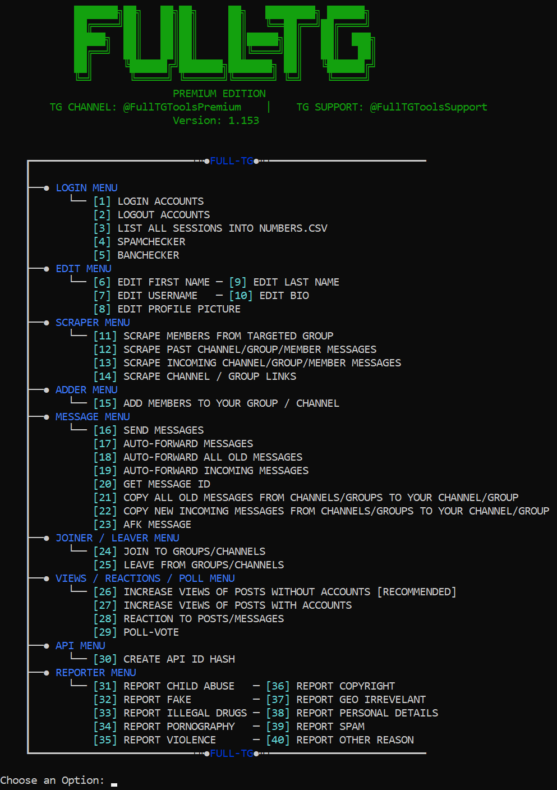

### Telegram-Automation-With-40-Functions-2024-Scraper-Adder-Forwarder-MassDM-And-More

FullTG is an all in one fully automated tool for Telegram. It is written in Python and very noob-friendly. No coding skills required! Simple to install and easy to use. Updates, new features and support for lifetime!
### 40 MAIN FUNCTIONS!

## BUY HERE: https://bitly.cx/ryZEC

VIDEO: https://youtu.be/DpBAr3v3FjA

For any questions, feel free to ask us on Telegram: https://t.me/FullTGToolsSupport

### What are the features?
This tool has a total of 40 features and tons of dynamic sub-features! New ones will be implemented!

- Login with as many accounts as you want! (No Limits)
