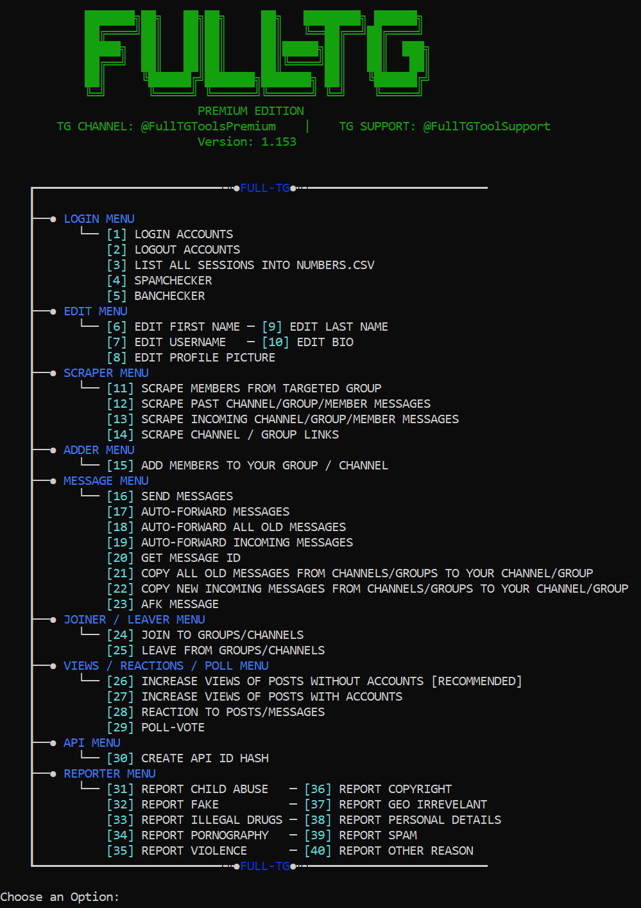

### Telegram-Automation-With-40-Functions-2024-Scraper-Adder-Forwarder-MassDM-And-More

FullTG is an all in one fully automated tool for Telegram. It is written in Python and very noob-friendly. No coding skills required! Simple to install and easy to use. Updates, new features and support for lifetime!
### 40 MAIN FUNCTIONS!

## BUY HERE: https://bitly.cx/ryZEC
### 💻 For more information: www.full-sc.com
VIDEO: https://youtu.be/DpBAr3v3FjA

For any questions, feel free to ask us on Telegram: https://t.me/FullTGToolSupport

### What are the features?
This tool has a total of 40 features and tons of dynamic sub-features! New ones will be implemented!

- Login with as many accounts as you want! (No Limits)

- Proxy Supported!
- Auto-Vote on any polls from any targets!
- Edit the username/first name/last name/bio/profile picture automatically!
- All edits can be done automatically by the tool!
- Scrape more than 150k members from targeted groups! It's also possible to scrape hidden members!

- Scrape past messages from any channels/groups/users!
- Scrape all incoming messages from any channels/groups/users!
- Use those scraped messages in the auto send messages feature (Mass DM)!

- Automatically send selected messages (MASS DM) to any channels/groups or your scraped members!
- Automatically forward selected messages to any channels/groups or your scraped members!
- Automatically forward all old messages to any channels/groups or your scraped members!
- Automatically forward all new incoming messages to any channels/groups or your scraped members!
- Filter only premium members of the scraped members!
- Add those scraped members to any group/channel you want!

- Get any message ID you want!
- Copy and send all incoming messages of any channels/groups/users to your channels/groups!
- Copy and send all old messages of any channels/groups/users to your channels/groups!

- Automatically send an AFK-message to anyone who messages you!
- Automatically join to any channels/groups!

- Automatically leave any channels/groups!
- Automatically increase the views of your posts without any accounts!

- Automatically increase the views of your posts with accounts!
- Automatically react to any posts of your targets with emojis!
- Automatically create API ID and HASH!
- Ban-Checker, check if your accounts are valid!
- Spam-Checker, check if your accounts are ready to be used!
- Report any members, groups or channels you want, with comments of your choice!
- And many other functions more! All functions can be seen on the menu picture above!
- MORE COMING SOON!
>All tasks above can be done by selected accounts or all accounts!

## BUY HERE: https://bitly.cx/ryZEC
### 💻 For more information: www.full-sc.com
VIDEO: https://youtu.be/DpBAr3v3FjA

For any questions, feel free to ask us on Telegram: https://t.me/FullTGToolSupport

### Whats so special about this?
1. This tool is the first tool, which can scrape more than 10k members at once!
2. You can also scrape hidden members!
3. Add the scraped members to your group / channel!
4. Multi-Account feature is supported!
5. Account switches at wish!
6. Multi-Api for more safety!
7. Use just one account or all of your accounts for these tasks!
8. Scraped members list automatically updates after adding members!
9. Add random delays between each task!
10. Increase your views with ease!
11. 100% positive feedbacks from customers!
12. We are implementing all features, which are being requested by our community!
13. Best All-In-1-Tool for Telegram!
14. Easy to install and to use!
15. Usable on all systems!
16. No coding skills required, noob-friendly!

#### Please ⭐ the repo to support our project
